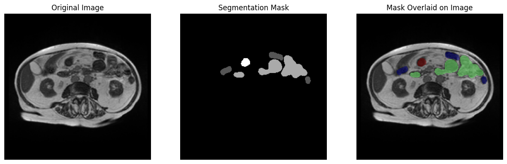
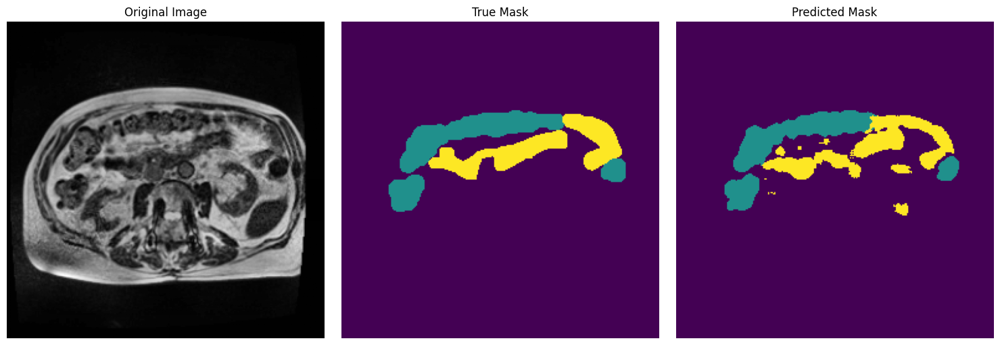
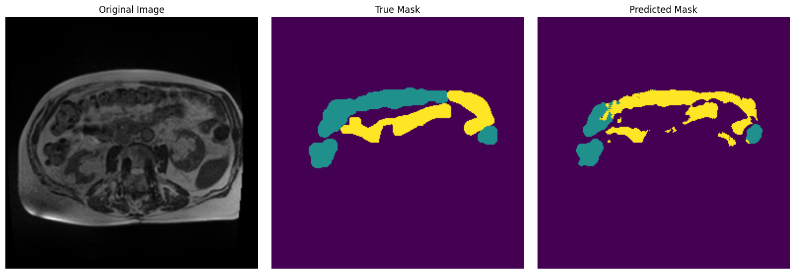

# Medical Image Preprocessing Pipeline for GI Tract Segmentation

This project implements a comprehensive preprocessing pipeline for gastrointestinal (GI) MRI images. The pipeline addresses common challenges in medical image analysis, with the intent of preparing high-quality data for training segmentation models and an end of goal enhancing the performance of deep learning segmentation applications on medical images.

## Table of Contents
- [Introduction](#introduction)
- [Dependencies](#dependencies)
- [Data & Format](#data--format)
- [Configuration](#configuration)
- [Execution](#execution)
- [Contact](#contact)

## Introduction

It's important that segmentation of the GI tract is accurate for streamlining the delivery of high-quality care to patients. In practice, radiation oncologist often manually segment out the positions of the stomach and intestines in order to avoid vital areas when directing x-ray beams during radiation therapy. This manual process is time-consuming; both for the pracitioner and the patient. By automating this process, we elimiate a lot of downtime for the patient while increasing the efficiency of the oncologist's workflow. Thus, we aim to develop a robust method for preparing high-quality image data that can feed into deep learning models, potentially enhancing their segmentation ability.


*Example of slice from UW-Madison Gi Tract Image Segmentation dataset. Original slice (left), RLE-decoded segmentation mask (center), segmentation mask overlaid on original slice (right)*

The key steps in this automated process are as follows:

* Wavelet denoising to suppress noise while maintain organ structures and sharpness
* Min-max intensity normalization to standardize the intensity range.
* Contrast Limited Adaptive Histogram Equalization to enhance contrast without over-amplification of noise.

We train two models: one on our preprocessed data, and one on unprocessed data. We evaluate the performance of each model on three metrics: Dice coefficient, 3D Hausdorff distance, and a weighted combined Dice-Hausdorff metric. We utilize a standard U-Net architecture for both models.

## Dependencies
The following Python libraries are utilized to build this project:

* SimpleITK
* NumPy
* Scikit-Image
* Pandas
* Tensorflow
* PyWavelets
* OpenCV
* Scikit-Learn
* Matplotlib
* glob
* os
* random
* collections.defaultdict

## Code Structure
The code structure of the project is organized into 5 main files:
* main.py
* utilities.py
* preprocessing.py
* model.py
* metrics.py
* create_dataset.py

## Data & Format

The dataset can found online at https://www.kaggle.com/competitions/uw-madison-gi-tract-image-segmentation/data.

Once downloaded, the structure of the data follows this format:

data/ 

└── train/ 

└── case101/ 

├── case101_day20/

│   └── scans/

│       ├── slice_0001.png

│       ├── slice_0002.png

│       └── ...

├── case101_day22/

│   └── scans/

│       └── ...

└── ...

This format is what the code will expect as well.

## Installation
#### Step 1
Clone the repository
```
bash
git clone https://github.com/Scouthoovy/DIP-GITractSegmentation.git
```

#### Step 2
Install dependencies listed in the [Dependencies](#dependencies) section

#### Step 3
1. Download the [UW-Madison GI Tract Image Segmentation](https://www.kaggle.com/competitions/uw-madison-gi-tract-image-segmentation/data) dataset from Kaggle.com
2. Extract the contents into a directory named data in your project directory.
3. Ensure the directory structure matches the expected format as described in the [Data & Format](#data--format) section.

#### Step 4
Ensure everything has been installed correctly by running the script momentarily. You should begin to see printouts similar to below:
```
case id 1/85
case id 2/85
...
```

## Execution
Each .py file contains necessary functions for running the experiment.

* utilities.py: contains functions for decoding RLE strings, plotting images, extracting masks from tf.Datasets, and building 3D volumes from slices.
* preprocessing.py: contains functions for applying the three main transformations: intensity normalization, CLAHE, and wavelet denoising.
* metrics.py: contains functions for calculating mean Dice coefficent, mean 3D Hausdorff distance, a combined metric of the two.
* model.py contains functions for building a U-Net model architecture.
* create_dataset.py: contains functions to load, filter, and split images into datasets.
* main.py: contains main() method for running full program. 

### Configuration

Simply running main.py will conduct the full pipeline, from loading the data to training the model and calculating the Dice coefficient and 3D Hausdorff distance. It will also save both trained models at the end.
If you wish to change any parameters, it would be best to do so within the main.py file.

Ensure you set the proper filepaths before running main.py.

### Results

We should expect to see:
* mean Dice coefficient for both unprocessed and processed data models.
* mean 3D Hausdorff distance for both unprocessed and processed data models.
* Weighted Dice + 3D Hausdorff distance metric for both unprocessed and processed data models.
* .h5 saves for both unprocessed and processed data models.

### Performance Comparison

Our preprocessing pipeline significantly improved segmentation performance across all evaluation metrics when applied to a standard U-Net architecture:

| Model | Dice Coefficient | 3D Hausdorff Distance | Weighted DH Metric |
|-------|------------------|------------------------|-------------------|
| U-Net + Unprocessed | 0.177 ± 0.312 | 0.401 ± 0.113 | 0.430 ± 0.142 |
| U-Net + Preprocessed | 0.768 ± 0.169 | 0.128 ± 0.061 | 0.830 ± 0.077 |
| **Improvement** | **+334%** | **-68%** | **+93%** |

For comparison, other published approaches on the same dataset:
- 2.5D U-Net [Zhou et al., 2023](https://doi.org/10.54097/fcis.v6i1.19): Dice = 0.848
- U-Net + Attention [Ye et al., 2022](https://doi.org/10.1007/978-3-031-20862-1_23): Dice = 0.911
- U-Net + Inception [Sah & Logofatu, 2025](https://doi.org/10.1007/978-3-031-77731-8_21): Dice = 0.91

### Examples
Examples images of the visual difference in segmentation performance can be see by viewing the two examples images in the example_images folder.



*Comparison of segmentation results: First row (Processed): Original MRI slice (left), Ground Truth Segmentation (Center), and Predictioned Segmentation (Right) First row is processed data, second row is unprocessed data.*


## Contact
Brayden Yarish - braydenyarish@gmail.com 

The University of Winnipeg - MSc Student


